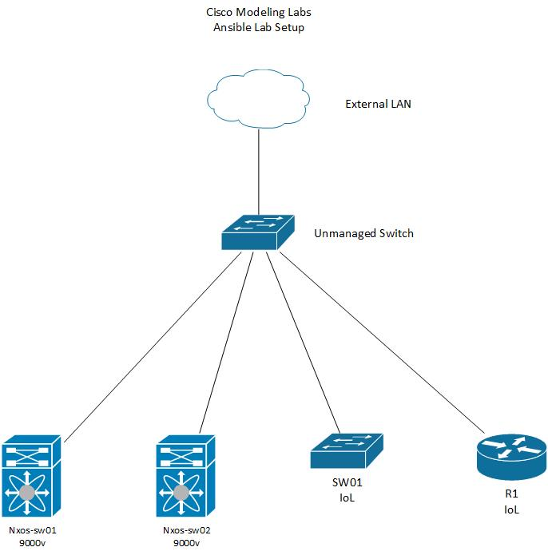

# cml-ansible 

This respository contains several playbooks to configure or backup Cisco IOS and NXOS devices. 
The devices are running in CML (Cisco Modeling Labs).

## Setup

Control Machine information

```
$ lsb_release -a
No LSB modules are available.
Distributor ID:	Ubuntu
Description:	Ubuntu 20.04.2 LTS
Release:	20.04
Codename:	focal

~/cml-ansible$ ansible --version
ansible 2.9.6
  config file = /home/jbowman/cml-ansible/ansible.cfg
  configured module search path = ['/home/jbowman/.ansible/plugins/modules', '/usr/share/ansible/plugins/modules']
  ansible python module location = /usr/lib/python3/dist-packages/ansible
  executable location = /usr/bin/ansible
  python version = 3.8.5 (default, Jan 27 2021, 15:41:15) [GCC 9.3.0]
~/cml-ansible$
```

## Tested Platforms

Tested using Cisco Modeling Labs:
  * IOS Router ---> IOSv 15.8(3)
  * IOS Switch ---> IOSv L2 2019
  * NXOS Switch ---> NXOS 9.2.3

## Toplogy



## Variables

### Group_vars
Variable file for each device group. This sets **ansible_network_os** and **ansible_connection** variables. **All.yml** file sets username and contains ansible-vault encrypted password for logging into devices.

### Host_vars
Variable file for each host. These files contain variables used in jinja2 templates.

## Playbooks
* get_facts - *uses Ansible gather_facts to gather and print facts about devices*
* config_vlans - *configures vlans on IOS and NXOS devices*
* config_vlans_w_tasks_dir - *configures vlans on IOS and NXOS devices using separate tasks for make/model*
* backup_config - *backup device configuration*
* ios_config - *configures IOS device using Ansible IOS Network Modules*
